# Claude Skills デモコレクション

Claude Skills ワークショップ用のデモSkill集です。シンプルな例から外部連携まで、段階的に学べる3つのSkillを収録しています。

## Claude Skills とは

Claude SkillsはClaudeに特定の機能や専門知識を追加できる拡張機能です。`SKILL.md`ファイルに定義されたプロンプトとツールの組み合わせにより、Claudeは新しいタスクを学習し実行できます。

### 自動発火の仕組み

```mermaid
flowchart LR
    A[ユーザー入力] --> B{description<br/>とマッチ?}
    B -->|Yes| C[Skill 自動起動]
    B -->|No| D[通常の応答]
    C --> E[allowed-tools<br/>の範囲で実行]
    E --> F[scripts/ 実行]
    E --> G[resources/ 参照]
```



### 主な特徴

| 特徴 | 説明 |
|------|------|
| **自動発火** | Skillの`description`に基づき、関連するリクエストで自動的に起動 |
| **ツール連携** | `allowed-tools`で使用するツールを制限・指定可能 |
| **スクリプト統合** | `scripts/`ディレクトリでPython等のコードを実行可能 |
| **リソース参照** | `resources/`で参考資料やテンプレートを提供可能 |

### Skill構成

```
skill-name/
├── SKILL.md           # 必須: Skill定義（YAML frontmatter + 説明）
├── scripts/           # 任意: 実行可能コード
│   └── main.py
├── resources/         # 任意: 参考資料・テンプレート
│   └── template.md
└── tests/             # 任意: テストコード
    └── test_main.py
```

---

## 実行例：Skillsはこう動く

各Skillがどのようなやりとりで発火し、どう実行されるかの具体例です。

### 例1: daily-report-generator

```
👤 ユーザー: 今週何やったか教えて

🤖 Claude: [daily-report-generator Skill が自動発火]

   1. git log --since="7 days ago" を実行
   2. コミットを分類:
      - docs: 3件
      - feat: 1件
   3. 週次レポート形式で出力

📄 出力:
   ## 週次レポート - 2025-11-22 〜 2025-11-28

   ### 主な成果
   - Claude Skills ワークショップ用デモを実装
   - 包括的なドキュメントを作成

   ### 数値サマリー
   - コミット数: 4
   - ドキュメント: 75%
   - 機能追加: 25%
```

**発火キーワード**: 「日報」「週報」「今日/今週何やった」「スタンドアップ」

---

### 例2: markdown-to-slides

```
👤 ユーザー: このMarkdownをプレゼン資料にして
   [presentation.md の内容を貼り付け]

🤖 Claude: [markdown-to-slides Skill が自動発火]

   1. Markdownを Read ツールで読み込み
   2. python scripts/md2slides.py を実行
   3. 生成されたPPTXを確認

📄 出力:
   ✅ スライドを生成しました

   - 入力: presentation.md
   - 出力: presentation.pptx (8スライド, 36KB)
   - テーマ: default

   スライド構成:
   1. タイトルスライド
   2. アジェンダ
   3. 財務ハイライト
   ...
```

**発火キーワード**: 「スライドに変換」「プレゼン資料を作って」「PPTXを生成」

---

### 例3: slack-notifier

```
👤 ユーザー: #dev-team にビルド成功を通知して

🤖 Claude: [slack-notifier Skill が自動発火]

   1. MCP (mcp__slack) の利用可否を確認
      → 利用不可
   2. SLACK_WEBHOOK_URL 環境変数を確認
      → 設定済み
   3. success テンプレートを適用
   4. Webhook経由で送信

📄 出力:
   ✅ Slackに送信しました

   チャンネル: #dev-team
   メッセージ:
   ┌────────────────────────────┐
   │ ✅ ビルド成功              │
   │ すべてのテストがパスしました │
   │ 📅 2025-11-28 06:43 UTC    │
   └────────────────────────────┘
```

**発火キーワード**: 「Slackに通知」「#channel に投稿」「チームに連絡」

---

### Skill発火の判定フロー

```mermaid
sequenceDiagram
    participant U as ユーザー
    participant C as Claude
    participant S as Skill
    participant T as Tools

    U->>C: 「今週の週報を作って」
    C->>C: description とマッチング
    Note over C: "週報" が daily-report-generator<br/>の description に含まれる
    C->>S: Skill 読み込み
    S->>C: SKILL.md の指示を取得
    C->>T: git log 実行
    T->>C: コミット一覧
    C->>C: 分類・フォーマット
    C->>U: 週次レポートを出力
```



---

## 収録Skill一覧

### 1. daily-report-generator（入門）

**難易度**: 初級
**概要**: Gitコミットログから日報・週報を自動生成

```
daily-report-generator/
└── SKILL.md           # スクリプト不要、Gitコマンドのみで動作
```

**特徴**:
- スクリプトなしの最小構成
- model-invoked（自動発火）の基本例
- 「日報を作って」「週報を書いて」で起動

**発火キーワード例**:
- 「今日の日報を作って」
- 「今週何やったか教えて」
- 「スタンドアップノート」

**出力形式**:
- デイリースタンドアップ形式
- 週次サマリー形式
- Slack投稿用形式

**実装詳細**:

このSkillはスクリプトを持たず、SKILL.md内の指示のみで動作します。

```yaml
# SKILL.md frontmatter
name: daily-report-generator
description: |
  GitコミットログとCalendar情報から日報・週報を自動生成するSkill。
  「日報を作って」「週報を書いて」などのリクエストで自動発火する。
# allowed-tools: 指定なし（全ツール使用可能）
```

**処理フロー**:

```mermaid
flowchart TD
    A[日報を作って] --> B[git log 実行]
    B --> C{期間判定}
    C -->|日次| D["--since='midnight'"]
    C -->|週次| E["--since='7 days ago'"]
    D --> F[コミット取得]
    E --> F
    F --> G[プレフィックスで分類]
    G --> H[feat: 機能追加]
    G --> I[fix: バグ修正]
    G --> J[doc: ドキュメント]
    H & I & J --> K[テンプレート適用]
    K --> L[フォーマット出力]
```



**ポイント**: `allowed-tools`を指定しないことで、Claudeが必要に応じてBash（git）、Read、Write等を自由に使用できます。

---

### 2. markdown-to-slides（中級）

**難易度**: 中級
**概要**: MarkdownファイルをPowerPoint（PPTX）に変換

```
markdown-to-slides/
├── SKILL.md              # Skill定義
├── scripts/
│   ├── md2slides.py      # CLIエントリポイント
│   ├── parser.py         # Markdownパーサー
│   └── generator.py      # PPTX生成
├── tests/
│   └── test_md2slides.py # 5テスト（全てパス済み）
└── resources/
    └── example.md        # サンプル入力
```

**特徴**:
- `scripts/`ディレクトリによるPython連携
- `allowed-tools`による使用ツール制限
- テストによる品質保証

**発火キーワード例**:
- 「Markdownをスライドに変換して」
- 「プレゼン資料を作って」
- 「PPTXを生成して」

**使用方法**:
```bash
python scripts/md2slides.py input.md output.pptx
python scripts/md2slides.py input.md output.pptx --theme corporate --aspect 16:9
```

**依存関係**:
```bash
pip install python-pptx
```

**実装詳細**:

3つのPythonモジュールで構成される本格的な実装です。

```yaml
# SKILL.md frontmatter
name: markdown-to-slides
description: |
  MarkdownファイルをPowerPointプレゼンテーション（PPTX）に変換するSkill。
  「Markdownをスライドに変換して」などのリクエストで自動発火する。
allowed-tools: Bash, Read, Write, Glob  # ツールを制限
```

**モジュール構成**:

```mermaid
flowchart LR
    subgraph Input
        A[input.md]
    end

    subgraph scripts/
        B[md2slides.py<br/>CLIエントリ]
        C[parser.py<br/>MarkdownParser]
        D[generator.py<br/>PresentationGenerator]
    end

    subgraph Output
        E[output.pptx]
    end

    A --> B
    B --> C
    C -->|PresentationData| D
    D --> E
```



| ファイル | 役割 | 主要クラス/関数 |
|---------|------|----------------|
| `parser.py` | Markdown解析 | `MarkdownParser`, `SlideContent`, `PresentationData` |
| `generator.py` | PPTX生成 | `PresentationGenerator`, テーマ定義 |
| `md2slides.py` | CLIエントリ | `main()`, argparse処理 |

**parser.py の実装**:
```python
@dataclass
class SlideContent:
    title: str = ""
    bullets: list[str] = field(default_factory=list)
    code_blocks: list[str] = field(default_factory=list)
    is_title_slide: bool = False

class MarkdownParser:
    def parse(self, content: str) -> PresentationData:
        # H1 → タイトルスライド
        # H2 → コンテンツスライド
        # - リスト → 箇条書き
        # ``` → コードブロック
```

**generator.py の実装**:
```python
THEMES = {
    "default": {"title_color": RGBColor(0x00, 0x00, 0x00), ...},
    "dark": {"title_color": RGBColor(0xFF, 0xFF, 0xFF), ...},
    "corporate": {"title_color": RGBColor(0x1A, 0x1A, 0x2E), ...},
}

class PresentationGenerator:
    def create_presentation(self, data: PresentationData, output_path: Path):
        # python-pptxでスライド生成
```

**ポイント**: `allowed-tools: Bash, Read, Write, Glob` でツールを制限し、不要な操作を防止しています。

---

### 3. slack-notifier（上級）

**難易度**: 上級
**概要**: Slackにフォーマット済みメッセージを送信（MCP + Webhook デュアルモード）

```
slack-notifier/
├── SKILL.md                    # Skill定義
├── scripts/
│   ├── send_webhook.py         # Webhook送信スクリプト
│   └── test_send_webhook.py    # 5テスト（モックのみ）
└── resources/
    ├── setup-guide.md          # セットアップ手順
    └── message-templates.md    # Slackテンプレート集
```

**特徴**:
- MCP統合（フルSlack API）とWebhookフォールバックの2モード
- `resources/`でドキュメントとテンプレートを提供
- 外部サービス連携のベストプラクティス

**発火キーワード例**:
- 「Slackに通知して」
- 「#dev-teamにメッセージを送って」
- 「チームに連絡して」

**連携モード比較**:

| 機能 | MCPモード | Webhookモード |
|------|-----------|---------------|
| メッセージ送信 | ✅ | ✅ |
| チャンネル一覧 | ✅ | ❌ |
| スレッド返信 | ✅ | ❌ |
| リアクション追加 | ✅ | ❌ |
| セットアップ難易度 | 中 | 簡単 |

**Webhookモードの使用方法**:
```bash
# 環境変数設定
export SLACK_WEBHOOK_URL="https://hooks.slack.com/services/T.../B.../..."

# メッセージ送信
python scripts/send_webhook.py --message "Hello from Claude!"

# テンプレート使用
python scripts/send_webhook.py --message "ビルド失敗" --template error --title "CIアラート"
```

**実装詳細**:

MCP統合とWebhookフォールバックの2モード対応により、柔軟な外部連携を実現しています。

```yaml
# SKILL.md frontmatter
name: slack-notifier
description: |
  Slackチャンネルにフォーマット済みメッセージを送信するSkill。
  「Slackに通知して」「#channelに投稿して」などのリクエストで自動発火する。
# allowed-tools: 指定なし（MCP含む全ツール使用可能）
```

**デュアルモード設計**:

```mermaid
flowchart TD
    A[Slackに通知して] --> B{MCP利用可能?}
    B -->|Yes| C[mcp__slack__<br/>slack_post_message]
    B -->|No| D{SLACK_WEBHOOK_URL<br/>設定済み?}
    D -->|Yes| E[send_webhook.py]
    D -->|No| F[エラー:<br/>セットアップ必要]

    C --> G[Slack API経由で送信]
    E --> H[HTTP POST送信]

    G --> I[✅ 送信完了]
    H --> I

    style C fill:#4CAF50,color:#fff
    style E fill:#2196F3,color:#fff
    style F fill:#f44336,color:#fff
```



**send_webhook.py の実装**:

```python
# テンプレート定義
TEMPLATES = {
    "success": {"blocks": [{"type": "section", "text": {"type": "mrkdwn",
                "text": ":white_check_mark: *{title}*\n{message}"}}]},
    "error":   {"blocks": [{"type": "section", "text": {"type": "mrkdwn",
                "text": ":rotating_light: *{title}*\n{message}"}}]},
    # warning, info も同様
}

def validate_webhook_url(url: str) -> bool:
    """Slack Webhook URLフォーマットを検証（セキュリティ対策）"""
    pattern = r'^https://hooks\.slack\.com/services/T[A-Z0-9]+/B[A-Z0-9]+/[a-zA-Z0-9]+$'
    return bool(re.match(pattern, url))

def send_message(webhook_url, message, template=None, title=None):
    """urllib.requestでHTTP POST送信"""
```

**resources/ の活用**:

| ファイル | 内容 |
|---------|------|
| `setup-guide.md` | MCP/Webhook両モードのセットアップ手順 |
| `message-templates.md` | Slack Block Kit形式のテンプレート集 |

**ポイント**:
- `allowed-tools`を指定せず、MCPツール（`mcp__slack__*`）も使用可能に
- Webhook URLの正規表現バリデーションでセキュリティ確保
- テンプレートシステムで統一されたメッセージフォーマット

---

## テストの実行

すべてのSkillにはテストが含まれています（計10テスト）。

### markdown-to-slides

```bash
cd markdown-to-slides
pip install python-pptx pytest
pytest tests/ -v
```

**テスト内容** (5テスト):
- `test_extracts_h1_as_title` - H1見出しがタイトルとして抽出される
- `test_h2_creates_content_slides` - H2見出しがコンテンツスライドを作成
- `test_creates_pptx_file` - PPTXファイルが正しく生成される
- `test_creates_correct_slide_count` - スライド数が正しい
- `test_full_conversion` - エンドツーエンドの変換テスト

### slack-notifier

```bash
cd slack-notifier
pytest scripts/test_send_webhook.py -v
```

**テスト内容** (5テスト):
- `test_valid_url_passes` - 有効なWebhook URLの検証
- `test_invalid_url_fails` - 無効なURLの拒否
- `test_success_template` - 成功テンプレートの適用
- `test_error_template` - エラーテンプレートの適用
- `test_successful_send` - モックによる送信成功テスト

> **Note**: Slack送信テストはモック化されており、実際のSlack APIは呼び出しません。

---

## ワークショップでの活用

### デモシナリオ

| Skill | デモポイント | 想定時間 |
|-------|-------------|----------|
| daily-report-generator | Skillの最小構成、自動発火の仕組み | 5分 |
| markdown-to-slides | scripts/連携、テスト、CLI設計 | 10分 |
| slack-notifier | MCP統合、外部サービス連携、セキュリティ | 10分 |

### ハンズオン課題例

1. **初級**: `daily-report-generator`のフォーマットを追加する
2. **中級**: `markdown-to-slides`に新しいテーマを追加する
3. **上級**: `slack-notifier`に新しいテンプレートを追加する

---

## セットアップ

### 前提条件

- Python 3.9以上
- Git
- (slack-notifier) Slack Workspace + Webhook URL または MCPサーバー設定

### インストール

```bash
# リポジトリをクローン
git clone <repository-url>
cd claude-skills

# 依存関係をインストール
pip install python-pptx pytest

# テストを実行して動作確認
cd markdown-to-slides && pytest tests/ -v
cd ../slack-notifier && pytest scripts/test_send_webhook.py -v
```

---

## 参考リンク

- [Claude Skills 公式ドキュメント](https://docs.anthropic.com/en/docs/build-with-claude/skills)
- [Model Context Protocol (MCP)](https://modelcontextprotocol.io/)
- [Slack API Documentation](https://api.slack.com/)
- [python-pptx Documentation](https://python-pptx.readthedocs.io/)

---

## ディレクトリ構成

```
claude-skills/
├── README.md                          # このファイル
├── daily-report-generator/            # 入門: シンプルなSkill
│   └── SKILL.md
├── markdown-to-slides/                # 中級: Python連携
│   ├── SKILL.md
│   ├── scripts/
│   │   ├── __init__.py
│   │   ├── md2slides.py
│   │   ├── parser.py
│   │   └── generator.py
│   ├── tests/
│   │   ├── __init__.py
│   │   └── test_md2slides.py
│   └── resources/
│       └── example.md
└── slack-notifier/                    # 上級: MCP + 外部連携
    ├── SKILL.md
    ├── scripts/
    │   ├── send_webhook.py
    │   └── test_send_webhook.py
    └── resources/
        ├── setup-guide.md
        └── message-templates.md
```

---

## ライセンス

MIT License

## 作成者

Claude Code ワークショップ用に作成
