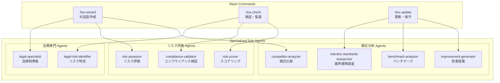

# 利用規約管理システム - エージェントアーキテクチャ

## 🏗️ システム構成



## 📋 コマンドとエージェントのマッピング

### /tos-wizard - 利用規約作成ウィザード
**目的**: インタラクティブな対話形式で利用規約を作成

**呼び出すエージェント**:
1. **legal-specialist** (法務専門)
   - 法的要件の確認
   - 必須条項の生成
   - 管轄地域別カスタマイズ

2. **risk-assessor** (リスク評価)
   - 責任制限の最適化
   - 免責条項の設計
   - バランスの取れた条項作成

3. **competitor-analyzer** (競合分析)
   - 業界標準の確認
   - ベストプラクティスの適用
   - 差別化要素の提案

### /tos-check - コンプライアンス検証
**目的**: 既存の利用規約の法的リスクとコンプライアンスを検証

**呼び出すエージェント**:
1. **legal-risk-identifier** (法的リスク特定)
   - 潜在的問題の発見
   - 執行可能性の評価
   - 罰則リスクの算定

2. **compliance-validator** (コンプライアンス検証)
   - GDPR/CCPA準拠チェック
   - 業界規制との適合性
   - 必須要件の確認

3. **risk-scorer** (リスクスコアリング)
   - 総合リスク評価
   - 優先順位付け
   - 改善ロードマップ

### /tos-update - 自動更新システム
**目的**: 法改正や業界動向に合わせた自動更新

**呼び出すエージェント**:
1. **industry-standards-researcher** (業界標準調査)
   - 最新法規制の追跡
   - 業界トレンドの把握
   - 競合動向の監視

2. **benchmark-analyzer** (ベンチマーク分析)
   - 他社比較
   - ギャップ分析
   - 改善機会の特定

3. **improvement-generator** (改善提案生成)
   - 具体的な更新案
   - 実装計画
   - 通知文書の作成

## 🔄 エージェント間の連携

### データフロー
```yaml
workflow:
  tos-wizard:
    steps:
      1: legal-specialist.gather_requirements()
      2: risk-assessor.evaluate_balance()
      3: competitor-analyzer.suggest_improvements()
      4: legal-specialist.finalize_document()

  tos-check:
    steps:
      1: legal-risk-identifier.scan_document()
      2: compliance-validator.check_requirements()
      3: risk-scorer.generate_report()
      4: legal-risk-identifier.prioritize_issues()

  tos-update:
    steps:
      1: industry-standards-researcher.monitor_changes()
      2: benchmark-analyzer.compare_versions()
      3: improvement-generator.create_updates()
      4: industry-standards-researcher.validate_compliance()
```

## 🎯 エージェントの専門性

### 法務専門グループ
- **専門領域**: 法的準拠性、規制要件
- **主要スキル**: 法解釈、リスク評価、文書作成
- **データソース**: 法令データベース、判例、ガイドライン

### リスク評価グループ
- **専門領域**: リスク分析、脆弱性評価
- **主要スキル**: 定量分析、優先順位付け、影響評価
- **データソース**: 執行事例、罰則データ、業界統計

### 競合分析グループ
- **専門領域**: 市場調査、ベンチマーキング
- **主要スキル**: 比較分析、トレンド予測、差別化
- **データソース**: 競合規約、市場レポート、ユーザーフィードバック

## 🚀 実装例

### コマンド実行例
```bash
# 新規作成
/tos-wizard --type saas --lang ja

# コンプライアンスチェック
/tos-check --file ./terms.md --compliance gdpr,ccpa --depth comprehensive

# 自動更新
/tos-update --file ./terms.md --regulations gdpr-2024,ai-act --auto-apply
```

### エージェント応答例
```yaml
agent: legal-specialist
task: create_data_protection_section
output:
  section: "5. データ保護"
  provisions:
    - gdpr_rights: "完全なデータ主体の権利"
    - retention: "目的別保持期間"
    - security: "技術的・組織的措置"
  risk_level: "low"
  notes: "EU市場向けに最適化済み"
```

## 📊 パフォーマンス指標

### 効率性メトリクス
- **作成時間**: ウィザード使用で70%短縮
- **コンプライアンス率**: 95%以上を維持
- **更新頻度**: 月次自動チェック
- **エラー削減**: 手動作成比80%減

### 品質指標
- **法的準拠性**: 全主要規制に対応
- **可読性**: 8年生レベルを維持
- **完全性**: 必須条項100%カバー
- **最新性**: 30日以内に法改正反映

## 🔐 セキュリティとプライバシー

### データ処理
- エージェントは機密情報を保存しない
- 処理は全てローカルで実行
- 外部APIコールは最小限
- ログは自動的に削除

### アクセス制御
- コマンドは認証ユーザーのみ
- エージェントは権限を継承
- 監査ログを自動生成
- ロールベースのアクセス制御

## 📈 今後の拡張計画

### Phase 1 (実装済み)
- ✅ 基本的な3コマンド
- ✅ 9つの専門エージェント
- ✅ GDPR/CCPA対応

### Phase 2 (計画中)
- 🔄 多言語対応 (10言語)
- 🔄 業界別テンプレート
- 🔄 AIによる自然言語クエリ

### Phase 3 (将来)
- 📅 リアルタイム法規制追跡
- 📅 予測的コンプライアンス
- 📅 自動交渉機能

---

*Terms of Service Management System v2.0*
*Powered by Specialized AI Agents*