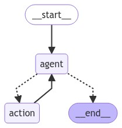
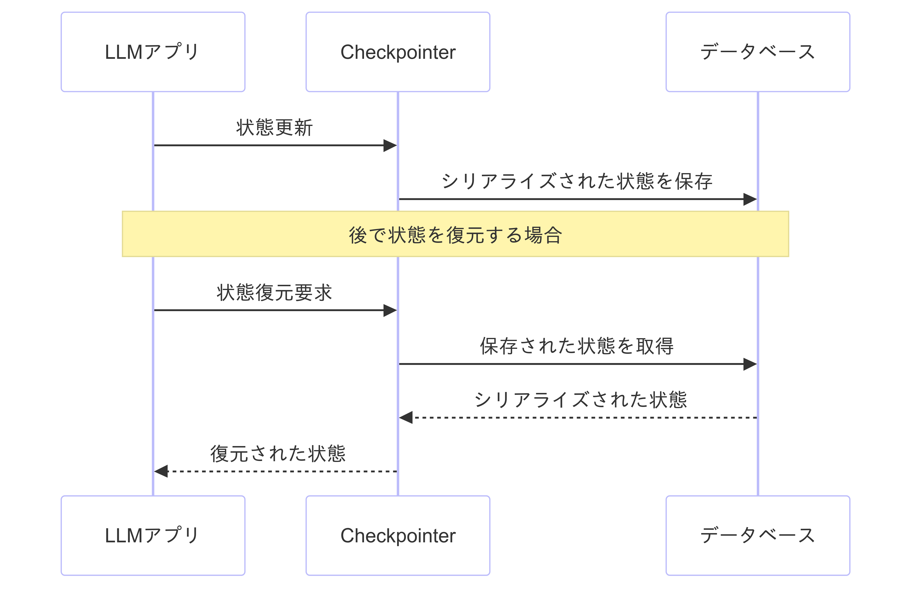

# LangGraphを用いたAIアプリケーションにおける<br>メモリ永続化の実践
### 2024/08/31 機械学習の社会実装勉強会 第38回

---
## 今回のお話
AIアプリケーション開発の新たな可能性を開くLangGraphのCheckpointer機能について、実際の動作をデモンストレーションを通じて紹介

---

## 自己紹介

- 名前: 西岡 賢一郎
   - Twitter: @ken_nishi
   - note: https://note.com/kenichiro
   - YouTube: [【経営xデータサイエンスx開発】西岡 賢一郎のチャンネル](https://www.youtube.com/channel/UCpiskjqLv1AJg64jFCQIyBg)
- 経歴
   - 東京大学で位置予測アルゴリズムを研究し博士 (学術) を取得
   - 東京大学博士課程在学中にデータサイエンスのサービスを提供する株式会社トライディアを設立
   - トライディアを売却し、CTOとして3年半務め、2021年10月末にCTOを退職
   - CDPのスタートアップ (Sr. CSM)・株式会社データインフォームド (CEO)・株式会社ディースタッツ (CTO)
   - プロダクト開発チーム・データサイエンスチームの立ち上げ
---

## LangChainとは

- 大規模言語モデル（LLM）を使用したアプリケーションを構築するためのフレームワーク
- 複雑なAIタスクを簡単に実装できるようにする
- さまざまなコンポーネントやツールを提供

---

## LangGraphとは

<style>
img[alt~="center"] {
  display: block;
  margin: 0 auto;
}
</style>

- LangChainの一部として開発されたライブラリ
- 状態を持つマルチアクターアプリケーションを構築するためのツール
- エージェントやマルチエージェントのワークフローを作成可能



---

## なぜ永続性が必要か？

1. **文脈の維持**
   - 複数の対話にわたって会話の文脈を保持
   - ユーザーとの長期的な対話を可能に

2. **状態の管理**
   - アプリケーションの現在の状態を保存
   - 必要に応じて以前の状態に戻る能力

3. **エラーからの回復**
   - 障害発生時に最後の正常な状態から再開可能

---

## 永続性の実現方法：Checkpointer

- LangGraphでは、「Checkpointer」を通じて永続性を実現

- **Checkpionterとは：**
   - アプリケーションの状態を保存し、必要に応じて復元する機能

---

## Checkpointerの主な特徴

1. **セッションメモリ**
   - ユーザーとのやり取りの履歴を保存
   - 保存された状態から会話を再開可能

2. **エラー回復**
   - 最後に成功した保存状態から継続可能
   - システム障害時の影響を最小限に

3. **ヒューマンインザループ**
   - 人間の介入や承認を要する処理の実装
   - AIと人間の協調作業をスムーズに

---

## Checkpointerの実装

[LangGraph v0.2](https://blog.langchain.dev/langgraph-v0-2/)で導入された新しいライブラリ：

- `langgraph_checkpoint`: 基本インターフェース
- `langgraph_checkpoint_sqlite`: SQLiteに保存 (開発・テスト用)
- `langgraph_checkpoint_postgres`: PostgreSQLに保存 (本番環境用)

---

## LangGraph v0.2 の変更
- 変数名変更
   - `thread_ts` → `checkpoint_id`
   - `parent_ts` → `parent_checkpoint_id`
- import方法の変更
   - 旧: `from langgraph.checkpoint import BaseCheckpointSaver`
   - 新: `from langgraph.checkpoint.base import BaseCheckpointSaver`
- SQLiteチェックポインターが分離: `langgraph-checkpoint-sqlite`

---

## Checkpointerの使用例

```python
from langgraph.graph import StateGraph
from langgraph.checkpoint.sqlite import SqliteSaver

# グラフの構築
builder = StateGraph(State)

# graphをcompileするときにcheckpointerを指定
with SqliteSaver.from_conn_string(":memory:") as memory:
    graph = builder.compile(checkpointer=memory)
```
---
## Checkpointerの仕組み


---

## Checkpointerの利点

1. **一貫性のある長期的な対話**
   - ユーザーとの会話履歴を保持し、文脈に応じた応答が可能

2. **堅牢なアプリケーション**
   - エラーや中断からの回復が容易

3. **複雑なワークフローの実現**
   - 人間の介入を含む高度な処理フローを構築可能

4. **開発の柔軟性**
   - 様々なデータベースに対応可能
   - カスタム実装の作成が容易

---

## 考慮事項

1. パフォーマンスへの影響
   - 履歴が増えるとLLM呼び出しに時間がかかる可能性

2. カスタマイズの制限
   - 履歴の動的な操作に一部制限あり

3. 実装の選択
   - 使用環境に適したCheckpointer機能の選択が重要

---
## デモンストレーション
- LangGraphのCheckpointer使用の実演
   - MemorySaver
   - SqliteSaver
   - PostgresSaver
- ソースコード: https://github.com/knishioka/machine-learning-workshop/blob/main/langchain/langchain_persistence.ipynb

---
## まとめ

- LangGraphのCheckpointerは、永続性を実現する強力なツール
- 長期的な対話、エラー回復、複雑なワークフローを可能に
- 適切に使用することで、より洗練されたAIアプリケーションの開発が可能

---

## 参考文献

1. [LangGraph公式ドキュメント](https://langchain-ai.github.io/langgraph/)
2. [LangGraph v0.2リリースブログ](https://blog.langchain.dev/langgraph-v0-2/)
3. [LangGraph Persistence How-to](https://langchain-ai.github.io/langgraph/how-tos/persistence/)