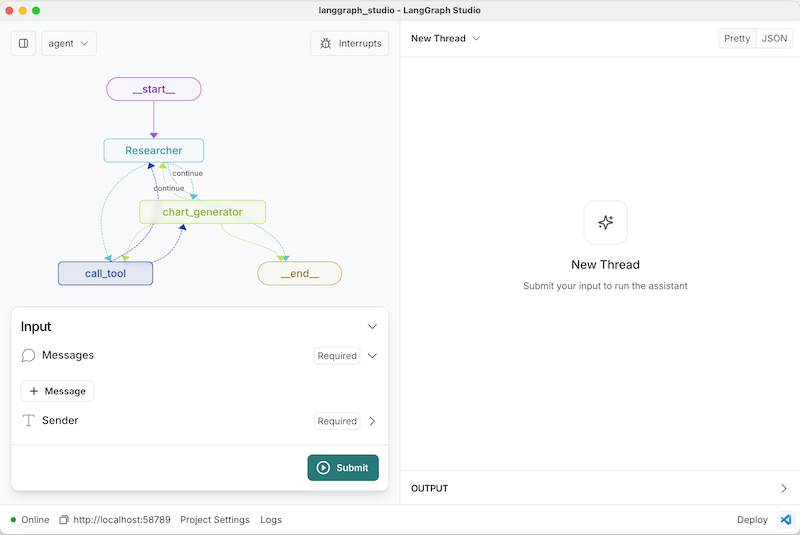

# LangGraphを用いたAIアプリケーションにおけAIエージェントの開発に特化した統合開発環境 LangGraph Studio
### 2024/09/29 機械学習の社会実装勉強会 第39回

---
# LangGraphが必要となる背景

---
## エージェント技術の進化

- LLM（大規模言語モデル）による新しいエージェントアプリケーションの誕生
- 自律型エージェントがより多くのタスクを自動化し、高度な意思決定を実行
- 開発者がこの進化に追随するために、エージェント専用の新しいツールの必要性

---
## エージェント開発における課題

- 複雑なワークフローの管理の難しさ
- APIコールやステート管理の煩雑さ
- エージェントの挙動を適切に管理するために多くの反復とデバッグが必要

---
## 従来のツールの限界

- 従来のツールではエージェントの動作フローが視覚化されない
- デバッグや修正がリアルタイムでできない
- 複雑なシステムに対応するための手段が不十分

---
# LangGraph Studio

---
## LangGraph Studioが解決する課題

- グラフによるワークフローのリアルタイム表示
- 実行中にエージェントの状態やロジックを修正可能
- 複雑なシステムの一元管理

---
## LangGraph Studioの利用方法
- Docker環境が必要
- 用意するファイル
    - requirements.txt
    - langgraph.json
    - graphを定義するスクリプト
- 提供されたインターフェースを通じてエージェントと対話

---

## エージェント技術の未来

- さまざまなタスクに対応できるマルチエージェントシステムの登場
- LangGraph Studioにより迅速な反復開発が可能に
- 複数のAIエージェントの相互作用の実現も簡単に

---

## 結論

- **エージェント開発の新しい標準**
  LangGraph Studioは、エージェント開発のプロセスを大きく変えるツールで、LLMを活用したシステム開発に役に立つ

- **効率的な開発プロセス**
  グラフでの可視化やリアルタイムデバッグにより、開発の手間を大幅に削減し、より迅速な反復が可能

- **未来に向けた備え**
  マルチエージェントシステムの拡張性や相互作用を容易にし、より複雑なAIエージェントを作成できる
