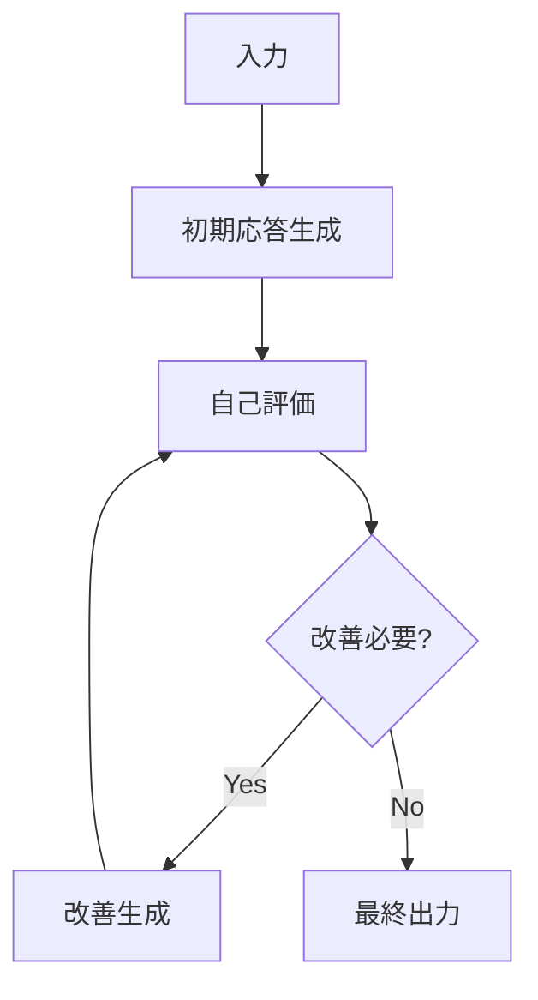

<!-- _class: title -->
# AIシステムの品質と成功率を向上させるReflection
## 機械学習の社会実装勉強会 第41回 (2024/11/30)

---
<style scoped>
ul {
  font-size: 22px;
}
</style>
# 自己紹介
- 名前: 西岡 賢一郎
  - X: @ken_nishi
  - LinkedIn: https://www.linkedin.com/in/kenichiro-nishioka/
  - Facebook: https://www.facebook.com/kenichiro.nishioka
  - note: https://note.com/kenichiro
  - YouTube: https://www.youtube.com/@kenichiro-nishioka
- 経歴
  - 東京大学で位置予測アルゴリズムを研究し博士 (学術) を取得
  - 東京大学の博士課程在学中にデータサイエンスをもとにしたサービスを提供する株式会社トライディアを設立
  - トライディアを別のIT会社に売却し、CTOとして3年半務め、2021年10月末にCTOを退職
  - 株式会社データインフォームド (CEO)・株式会社ディースタッツ (CTO)・CDPのスタートアップ (Sr. CSM)
  - 自社および他社のプロダクト開発チーム・データサイエンスチームの立ち上げ経験

---
# 本日の課題認識

1. **現状のAIシステムの限界**
   - 単一の応答に依存
   - エラーの繰り返し
   - 一貫性の欠如

2. **解決の方向性**
   - 人間の学習プロセスからヒントを得る
   - 振り返り（Reflection）の重要性
   - システマティックな改善プロセス

---
# 人間の学習プロセスに学ぶ

1. **行動者タイプの特徴**  
   - とにかく行動するが、振り返りをしないタイプ
   - 結果：同じ失敗を繰り返す可能性大
   
2. **反省者タイプの特徴**  
   - 行動後に結果を振り返り、次に活かすタイプ
   - 結果：徐々に改善・成長を実現
   - AIにもこの能力を実装することが重要

---
# なぜAIにReflectionが必要か？

**現状のAI**
- 単一のプロンプトに基づく応答
- 過去の失敗から学習できない
- コンテキストの理解が限定的

**Reflectionによる改善**
- 自己評価による品質向上
- エラーの検出と修正
- より深い文脈理解

---
# Reflection Agentのアーキテクチャ



**主要コンポーネント**
1. 初期応答生成エンジン
2. 評価エンジン
3. 改善生成エンジン

---
# エッセイ改善の例

**初期エッセイ（抜粋）**
```text
環境保護は私たちの未来にとって重要です。
地球温暖化は深刻な問題です。
私たちは行動を起こす必要があります。
```

**Reflectionプロセス**
1. 評価：具体性不足、データ欠如
2. 改善案：統計データ追加、具体例提示

**改善後**
```text
環境保護は、人類の持続可能な未来に不可欠です。
IPCCの2023年報告によると、過去10年で世界の平均気温は
1.1℃上昇し、生態系に深刻な影響を及ぼしています。
例えば、北極圏の氷床面積は年間約13%の割合で減少し...
```

---
# Reflection Agentの実務活用例

## 1. カスタマーサポート
- **Before**: 一般的な応答
- **After**: 過去の類似ケース参照による最適解提示

## 2. 技術文書作成
- **Before**: 基本的な仕様書
- **After**: エッジケースを考慮した包括的文書

## 3. コードレビュー
- **Before**: 表面的なチェック
- **After**: セキュリティ面も含めた多角的レビュー

---
# 今後の展望：Reflectionの進化

1. **現在のReflection（反省者型）**
   - 行動後の振り返りと改善
   - エラー検出と修正
   - 品質向上の実現

2. **将来の発展（戦略的行動者型）**
   - 事前の仮説設定と計画立案
   - 結果予測に基づく最適化
   - 自律的な意思決定と改善

3. **技術的な発展方向**
   - マルチモーダルReflection
   - 分散処理アーキテクチャ
   - 自己学習型評価システム

---
# 結論：ReflectionがもたらすAIの進化

1. **品質向上**
   - エラー率の低減
   - 一貫性の向上
   - 文脈理解の深化

2. **効率化**
   - 作業時間の短縮
   - リソース使用の最適化
   - コスト削減

3. **発展の可能性**
   - より高度な自己改善能力
   - 人間との協調進化
   - 新しいAIの可能性

---
# お問い合わせ
- お仕事の依頼・機械学習・LLMの実装のご相談は、X, LinkedIn, FacebookなどでDMをください
- 機械学習を社会実装する仲間も募集中!!