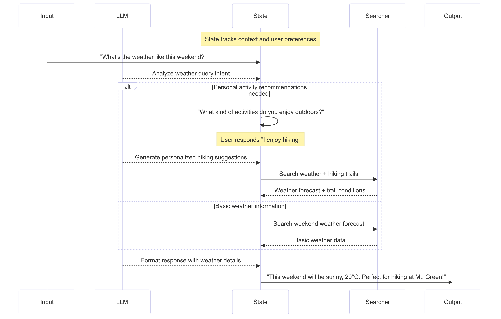

<!-- _class: title -->
# LangGraphを使ったHuman in the loop
## 機械学習の社会実装勉強会 第42回 (2024/12/28)

---

# 自己紹介
- 名前: 西岡 賢一郎
  - X: @ken_nishi
  - LinkedIn: https://www.linkedin.com/in/kenichiro-nishioka/
  - Facebook: https://www.facebook.com/kenichiro.nishioka
  - note: https://note.com/kenichiro
  - YouTube: https://www.youtube.com/@kenichiro-nishioka
- 経歴
  - 東京大学で位置予測アルゴリズムを研究し博士 (学術) を取得
  - 東京大学の博士課程在学中にデータサイエンスをもとにしたサービスを提供する株式会社トライディアを設立
  - トライディアを別のIT会社に売却し、CTOとして3年半務め、2021年10月末にCTOを退職
  - 株式会社データインフォームド (CEO)・株式会社ディースタッツ (CTO)・CDPのスタートアップ (Sr. CSM)
  - 自社および他社のプロダクト開発チーム・データサイエンスチームの立ち上げ経験

---
# 本日のアジェンダ
1. 概要
  - LLMアプリケーションにおけるHITLの意義
  - 主要なデザインパターンとユースケース
  - interrupt機能による実装方法

2. 期待される効果
  - LLM出力の品質向上
  - 柔軟な制御フローの実現
  - 開発効率の向上

---
# Human in the loopの基本概念
## なぜHITLが必要か

- LLMの出力における不確実性への対応
- 重要な判断における人間の介入
- プロセスの信頼性確保

## 主要なアクション

- 承認/却下（Approve/Reject）
- State編集（Edit State）
- 入力要求（Get Input）

---
# Human in the loopの例

---
# デザインパターン1: Approve/Reject Pattern

- 目的: クリティカルな操作前の確認
- 特徴:
  - プロセスの一時停止
  - 承認/却下に基づくルーティング
  - 代替アクションの実行
- ユースケース: API呼び出し、重要な決定

---
# デザインパターン2: Edit State Pattern

- 目的: Stateの確認と修正
- 特徴:
  - 現在のStateの提示
  - 編集可能な形式での表示
  - 変更の反映と検証
- ユースケース: 生成内容の修正、パラメータ調整
- 生成された回答をLLMに評価させ修正する

---
# デザインパターン3: Get Input Pattern

- 目的: 明示的な入力の収集
- 特徴:
  - 特定ステップでの入力要求
  - マルチターン対話のサポート
  - コンテキストの拡充
- ユースケース: 情報収集、意図の明確化

---
# Human in the loopを実現するLangGraphの機能
- interrupt: Graphの処理を一時停止
- Command: Stateの更新, 処理再開, フロー制御

---
# interrupt機能の基本

- 目的と役割
  - プロセスを一時停止して人間の介入を可能にする
  - 現在のStateをクライアントに提示
  - 人間からの入力を受け取って処理を再開
- 動作の仕組み
  - ノード内でinterrupt()を呼び出し
  - ~~GraphInterrupt例外が発生してプロセスが停止~~
  - Stateが保存され、クライアントに通知
  - 人間からの入力後、同じノードから処理を再開

---
# Command機能の詳細

- State更新（update）の使い方
  - 人間からの入力でStateを更新
    - 例：生成テキストの編集内容を反映, 承認情報の追加
- 処理再開（resume）の制御
  - interrupt後の再開値の指定
    - 例：承認/却下の判断結果, 編集された内容
- フロー制御（goto）のパターン
  - 単純な遷移, 条件付き遷移, 複数ステップの指定

---
# 実装時の重要ポイント

1. State管理の考慮事項
  - チェックポインターの必要性: Stateの保存と復元に必須, セッション管理との連携
  - 再実行時の考慮: 同じノードが複数回実行される可能性, べき等性の確保
2. 複数のinterruptの取り扱い
  - 順序管理の重要性: 実行順序に基づく対応付け, スコープの理解
  - エラー処理: タイムアウトの設定, 例外時の代替フロー
3. ユーザビリティの考慮
  - 適切なタイミングでの介入, 必要な情報の提示, 分かりやすい選択肢の提供
 
---
# まとめ1
## デザインパターンと実装戦略
- Approve/Reject Pattern
  - ユースケース：API実行承認、重要な更新の確認、リスク判断
  -実装のポイント：明確な判断基準の設定、代替フローの準備
- Edit State Pattern
  - ユースケース：LLM出力の修正、パラメータ調整、データの補完
  - 実装のポイント：Stateの永続化、変更履歴の管理
- Get Input Pattern
  - ユースケース：追加情報の収集、意図の明確化、選択肢の提示
  - 実装のポイント：適切なプロンプト設計、タイムアウト管理

---
# まとめ2
## コア機能の活用ポイント

- interrupt機能: チェックポインターの設定、状態管理の設計、エラー処理戦略
- Command機能: 状態更新の管理、フロー制御の最適化、再開ロジックの実装

## 実装のベストプラクティス

- 小規模なプロトタイプからの段階的な機能追加
- 明確な介入ポイントと判断基準の設定
- エラー処理とリカバリー戦略の確立
- ユーザビリティとパフォーマンスの最適化

---
# お問い合わせ
- お仕事の依頼・機械学習・LLMの実装のご相談は、X, LinkedIn, FacebookなどでDMをください
- 機械学習を社会実装する仲間も募集中!!