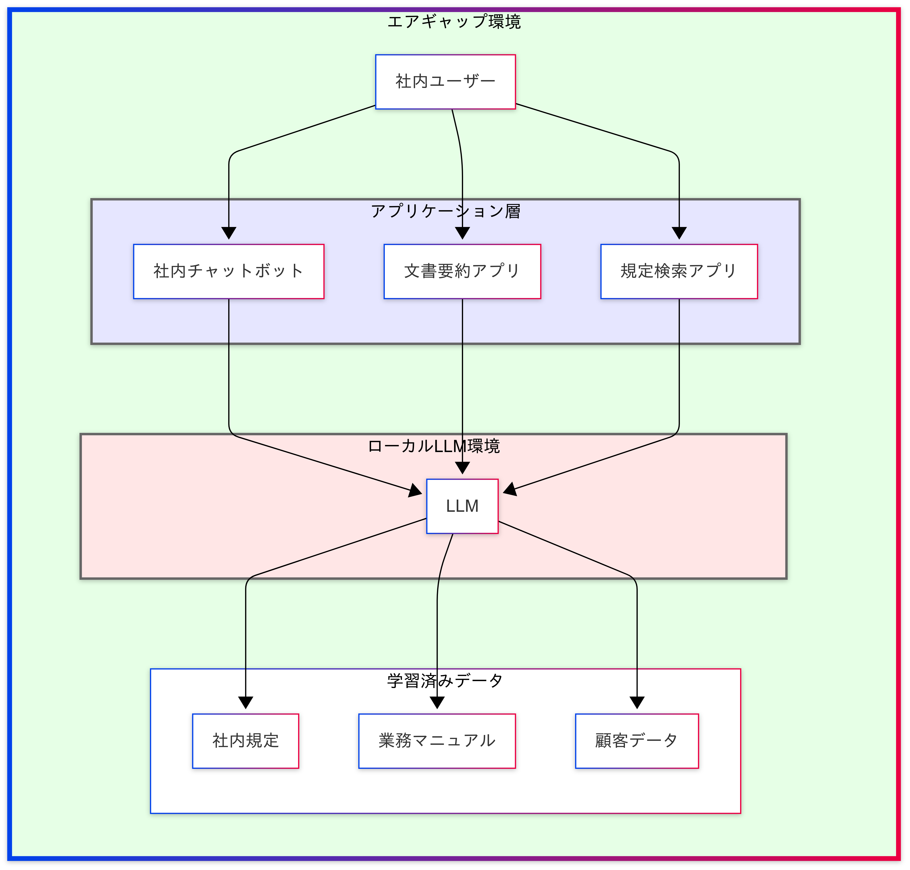
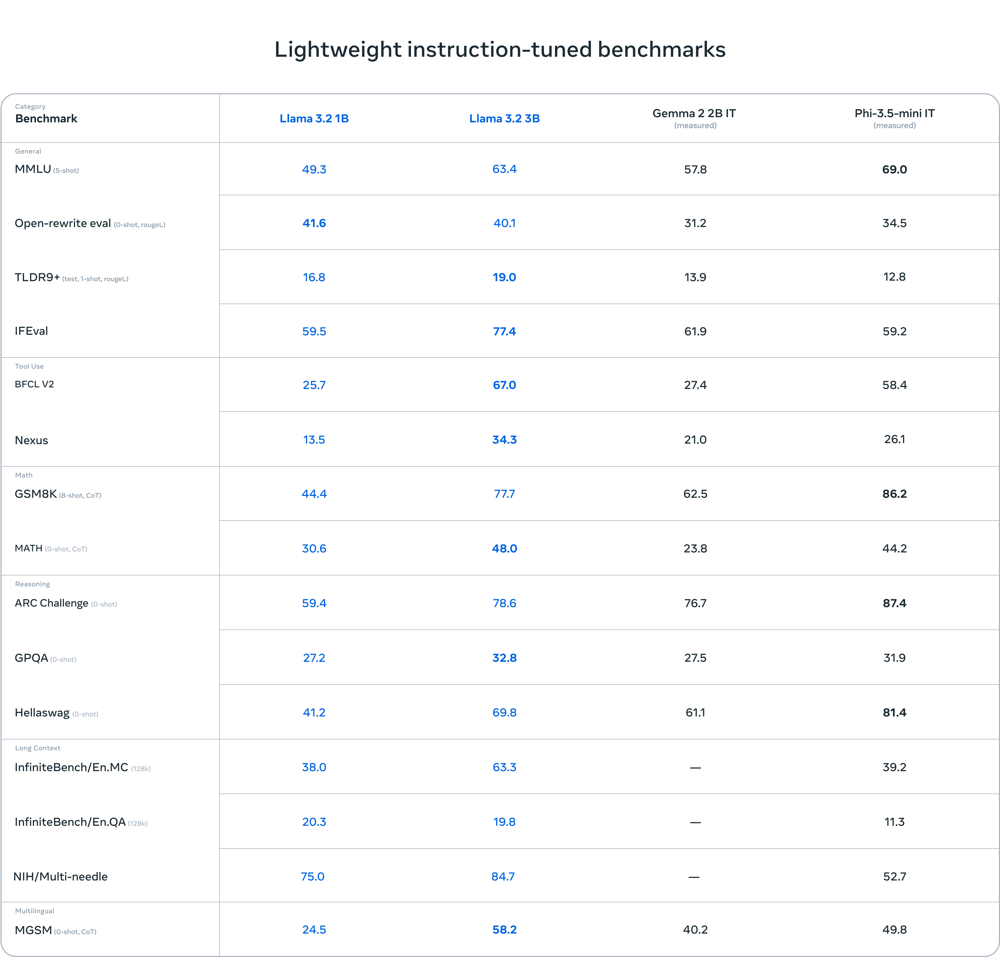
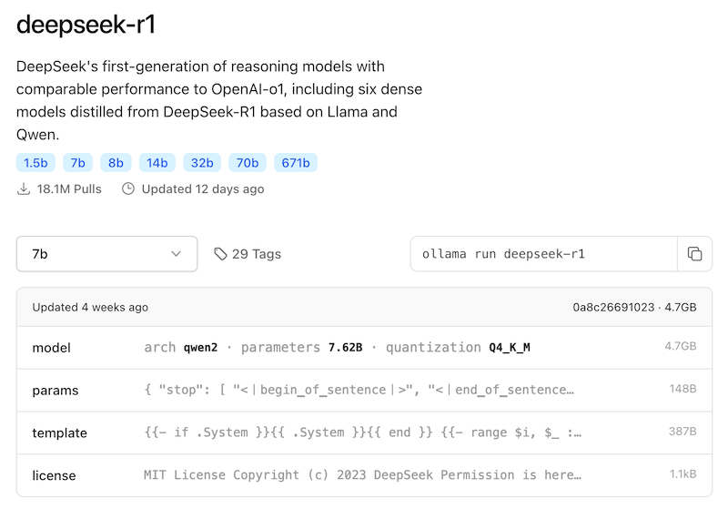
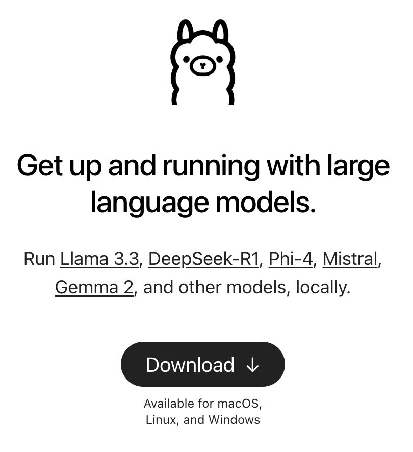

<!-- _class: title -->
# DeepSeekを使ったローカルLLM構築
## 機械学習の社会実装勉強会 第44回 (2025/02/22)

---
<!-- _class: split -->

<style scoped>
ul {
  font-size: 22px;
}
h1 {
  margin-bottom: -10px;
}
</style>

# 自己紹介

<div class="ldiv">

- 名前: 西岡 賢一郎
  10年以上にわたり、データ分析や機械学習の分野でスタートアップの経営に携わる。現在は、日本とマレーシアを拠点に活動中。
- SNS
  - X: @ken_nishi
  - LinkedIn: https://www.linkedin.com/in/kenichiro-nishioka/
  - Facebook: https://www.facebook.com/kenichiro.nishioka
  - note: https://note.com/kenichiro
  - YouTube: https://www.youtube.com/@kenichiro-nishioka
</div>
<div class="rdiv">

経歴
- 東京大学で位置予測アルゴリズムを研究し博士 (学術) を取得
- 東京大学の博士課程在学中にデータサイエンスをもとにしたサービスを提供する株式会社トライディアを設立
- トライディアを別のIT会社に売却し、CTOとして3年半務め、2021年10月末にCTOを退職
- 株式会社データインフォームド (CEO)・株式会社ディースタッツ (CTO)・CDPのスタートアップ (Sr. Solution Architect)
- 自社および他社のプロダクト開発チーム・データサイエンスチームの立ち上げ経験

</div>

---

# アジェンダ

1. Local LLMが求められる背景
2. Local LLMで使えるオープンソースモデル
3. Local LLMを動かすプラットフォーム
4. まとめ

---

# Local LLMが求められる背景

---

<style scoped>
li {
  font-size: 22px;
}
h1 {
  margin-bottom: -10px;
}
</style>

# Local LLMの戦略的必要性

<!-- _class: split -->

<style scoped>
li {
  font-size: 18px;
}
h2 {
  font-size: 22px;
}
</style>

<div class="ldiv">

1. データセキュリティとプライバシー
  - 社内に機密データを留めたまま AI 活用が可能
  - クラウド型と異なり、外部への情報送信が不要
  - 製品開発情報や顧客データの漏洩リスクを最小化
2. レスポンス時間の改善
  - インターネット接続に依存しない安定した応答
  - エッジでの処理によるレイテンシの最小化
  - リアルタイム性が求められる製造ラインでの活用に対応
3. コスト面での利点
  - APIコール課金が不要
  - 利用量に関係なく固定費での運用が可能
  - 大規模な文書処理での優位性

</div>

<div class="rdiv">
  
</rdiv>

---

<!-- _class: split -->

<style scoped>
li {
  font-size: 18px;
}
h2 {
  font-size: 22px;
}
</style>

<div class="ldiv">

# 産業別活用事例

## 金融業界での活用
- 機密性の高い投資戦略文書の分析
- 非公開の取引データを用いた不正検知
- 顧客の資産情報を含む文書要約

## 製造業での実装
- 製造ラインでのリアルタイム異常検知
- 社外秘の設計図面からの情報抽出
- 工場内の閉域ネットワークでの稼働分析

## 医療分野での展開
- 患者の個人情報を含むカルテ分析
- 院内システムでの処方箋チェック
- 医療画像の即時診断支援

</div>

<div class="rdiv">
  
</div>

---

# Local LLMで使えるオープンソースモデル

---

<!-- _class: split -->

<style scoped>
li {
  font-size: 18px;
}
h1 {
  font-size: 40px;
}
h2 {
  font-size: 22px;
}
</style>


# 主要なオープンソースモデル


<div class="ldiv">

- Meta Llama, Google Gemma, Microsoft Phi, DeepSeekなど様々なモデルがオープンソースで利用可能となっている
- 同じモデルでもパラメータ数が異なるバージョンが提供されている (例: llama3.2:3b, llama3.2:1b)
- パラメータ数が多いほどモデルサイズが大きくなり賢くなる
- 同じパラメータ数でもモデルによって得意・不得意分野が異なる

</div>

<div class="rdiv">
<div class="rdiv">
  
  <div style="font-size: 20px">出典: https://ollama.com/library/llama3.2</div>
</div>
</div>

---

<!-- _class: split -->

<style scoped>
li {
  font-size: 18px;
}
h1 {
  font-size: 40px;
}
h2 {
  font-size: 22px;
}
</style>


# Deepseek


<div class="ldiv">

- 中国DeepSeek社のV3/R1シリーズは、MoE（Mixture of Experts）アーキテクチャとMLA（Multi-head Latent Attention）技術を組み合わせ、GPT-4o同等性能を低コストで実現
- 数学・コーティング・推論タスクで高性能
- モデルが公開されており商用利用可能

</div>

<div class="rdiv">
<div class="rdiv">
  
  <div style="font-size: 20px">出典: https://ollama.com/library/deepseek-r1</div>

</div>
</div>

---

# Local LLMを動かすプラットフォーム

---

# 主要プラットフォームの比較
<!-- _class: split -->

<style scoped>
td, li {
  font-size: 18px;
}
h2, th {
  font-size: 22px;
}
</style>

<div class="ldiv">

| 特徴 | Ollama | LM Studio | vLLM |
|---|---|---|---|
| 利用方式 | CLI + API | GUI | API |
| モデル | 多数のOSS LLM | 60以上のOSS LLM | HuggingFaceモデル |
| ライセンス | オープンソース | クローズド | オープンソース |
| 商用利用 | 可能 | 要リクエスト | 可能 |

</div>

<div class="rdiv">

## 選定のポイント
- CLIベース開発：Ollama
- GUI操作重視：LM Studio
- 高速処理重視：vLLM

</div>

---

<style scoped>
li {
  font-size: 18px;
}
h2 {
  font-size: 22px;
}
</style>

# Ollama
<!-- _class: split -->

<div class="ldiv">

## 主な特徴

- **ローカル実行**: プライバシー保護、オフライン利用可能
- **使いやすさ**: マルチプラットフォーム、CLIインターフェース
- **高度な機能**: GPUアクセラレーション、REST API対応
- **多様なモデル**: Llama 2, Code Llama等をサポート
- **オープンソース**: 無料で利用可能、カスタマイズ可能

</div>

<div class="rdiv">
<div class="rdiv">
  
</div>
</div>

---
<style scoped>
li {
  font-size: 18px;
}
h2 {
  font-size: 22px;
}
</style>
# Ollamaを選ぶ理由

1. インストールの簡単さ: MacならHomebrewでインストール可能
   ```bash
   brew install ollama
   ```
1. モデルの管理が用意
   ```bash
   ollama pull deepseek-r1:8b # モデルの取得
   ollama list # インストール済みモデルの表示
   ollama rm deepseek-r1:8b # モデルの削除
   ```
1. モデルをすぐに実行可能
   ```bash
   ollama run deepseek-r1:8b
   ```
1. APIアクセス可能
   ```bash
   url -X POST http://localhost:11434/api/generate -d '{
    "model": "deepseek-r1:8b",
    "prompt":"Why is the sky blue?"
   }'
   ```
1. Modelfileを使ったモデルのカスタマイズも可能 (次のページ参照)
---

<style scoped>
li {
  font-size: 22px;
}
</style>

# Ollama Modelfile

カスタムAIモデルを作成・管理するための設定ファイル

- **主な構文**
  - `FROM <base-model>`：ベースモデルを指定
  - `SYSTEM "<text>"`：システムプロンプトを設定
  - `PARAMETER key=value`：モデルのパラメータ（例：`temperature=0.7`）を設定
  - `TEMPLATE "<prompt-template>"`：入力フォーマットをカスタマイズ
  - `ADAPTER <adapter>`：LoRAや追加学習済みモデルを適用

- **特徴**
  - **カスタマイズ可能**：プロンプトやパラメータを自由に設定可能
  - **軽量な記述**：Dockerfileのようなシンプルな形式
  - **ローカル実行対応**：PC上で簡単にモデルを管理・実行可能

---

# CLIで複数モデルの連携が可能
- pipeで入出力をつなぐことで異なるモデルを簡単に連携可能
  ```bash
  ollama run planner-model "<タスク>" | ollama run solver-model | ollama run translator-model
  ```
- System Promptを指定して独自モデルを作る
  - Modelfile内でSystem Promptを設定し特定の挙動に特化したモデルを作成
    ```makefile
    # llama3.1-planner.modelfile
    FROM llama3.1
    SYSTEM """
    あなたは別のAIへの指示を作成するアシスタントです。
    与えられた質問に答えるためのプランニングをしてください。
    """
    ```
  - Modelfileから独自モデルを作成
    ```bash
    ollama create llama3.1-planner -f llama3.1-planner.modelfile
    ```
---

# デモ
- Ollamaの基本操作
- OllamaでDeepSeekを実行
- Modelfileでカスタマイズ

---

# まとめ

1. Local LLMはセキュリティ・速度・コストのメリットがある
1. オープンソースの公開やLocal LLMを動かす技術基盤の成熟により導入障壁が低下
1. マシンスペックに合わせて大小様々なモデルを選択可能
1. Ollamaを用いて簡単にモデルを管理
1. Ollamaをpipeで利用することで複数のモデルを連携可能

---
# お問い合わせ
- お仕事の依頼・機械学習・LLMの実装のご相談は、X, LinkedIn, FacebookなどでDMをください
- 機械学習を社会実装する仲間も募集中!!