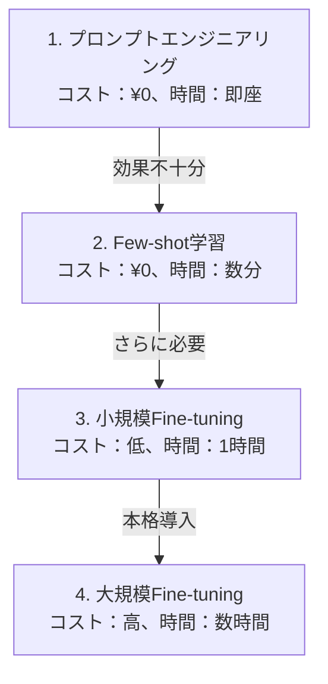

# LLM Fine-tuning 実践ガイド
## プロンプトエンジニアリングを超えて

---

## 📋 アジェンダ（45分）

1. Fine-tuningとは何か？（5分）
2. Ollamaの誤解を解く（5分）
3. Fine-tuningの実際（10分）
4. 実演デモ（10分）
5. Ollamaで使うまでの手順（7分）
6. 検証結果と現実（5分）
7. 実践的なアプローチ（3分）
8. まとめとQ&A（5分）

---

## 1. Fine-tuningとは何か？（5分）

### 🎯 話すポイント
- モデルの重みを更新して、特定タスクに特化させる技術
- 新しい知識を学習させることができる
- プロンプトエンジニアリングとの本質的な違い

### プロンプトエンジニアリング vs Fine-tuning

| 項目 | プロンプトエンジニアリング | Fine-tuning |
|------|-------------------------|-------------|
| **学習** | 既存知識の活用のみ | 新しい知識を学習可能 |
| **コスト** | 無料・即座に実行 | GPU必要・時間がかかる |
| **効果** | 限定的（表面的な調整） | 根本的な動作変更可能 |
| **データ量** | 数個の例で可能 | 最低50-100サンプル必要 |

### 💡 具体例で説明
```
プロンプト：「カスタマーサポートとして回答して」
→ 一般的な回答しかできない

Fine-tuning：自社の具体的な返品ポリシー、価格表を学習
→ 「14日間返品無料、送料は￥500」など具体的に回答
```

---

## 2. Ollamaの誤解を解く（5分）

### 🎯 話すポイント
- よくある誤解：「OllamaでFine-tuningができる」は間違い
- Ollamaは「実行専用」ツール
- Modelfileは単なるプロンプト設定

### なぜOllamaでFine-tuningができないのか？

1. **設計思想の違い**
   - Ollama = モデルを「動かす」ためのツール
   - Fine-tuning = モデルを「訓練する」プロセス

2. **技術的制限**
   - OllamaはGGUF形式（実行用）を使用
   - Fine-tuningはPyTorch形式（訓練用）が必要

3. **リソースの違い**
   - Ollama：CPUでも動作、軽量
   - Fine-tuning：GPU必須、大量メモリ

### ✅ Ollamaでできること
```dockerfile
FROM llama3.2:1b
SYSTEM "あなたはカスタマーサポートです"
PARAMETER temperature 0.7
```
→ これは単なるプロンプト設定（Fine-tuningではない）

### ❌ Ollamaでできないこと
- モデルの重みの更新
- 新しい知識の学習
- 独自データでの訓練

---

## 3. Fine-tuningの実際（10分）

### 🎯 話すポイント
- 実際のワークフローを図解
- 必要なツールと役割
- データ準備の重要性

### Fine-tuningワークフロー


### 必要なツール

1. **訓練フェーズ**
   - PyTorch：深層学習フレームワーク
   - Hugging Face Transformers：事前学習モデル
   - PEFT（LoRA）：効率的な訓練手法

2. **変換フェーズ**
   - llama.cpp：GGUF変換ツール
   - 量子化ツール：ファイルサイズ削減

3. **実行フェーズ**
   - Ollama：最終的な実行環境

### 訓練データの形式

```json
{
  "instruction": "配送料について教えてください",
  "output": "配送料は以下の通りです：\n- 通常配送：￥500\n- 5,000円以上：送料無料\n- 速達：￥800"
}
```

💡 **ポイント**：具体的な数値、ルールを含むデータが重要

---

## 4. 実演デモ（10分）

### 🎯 話すポイント
- 実際の実行時間を見せる（40秒で完了！）
- Before/Afterの違いを実演
- 期待値の調整（完璧ではない）

### デモ1：TinyLlama Fine-tuning（最速）

```bash
# 1. Fine-tuning実行（40秒）
python scripts/tinyllama_fine_tuning.py
```

**実行ログを表示**：
```
使用デバイス: mps
trainable params: 2,359,296 || all params: 1,102,885,120
訓練時間: 0:00:40.123456
```

### デモ2：効果の検証

```bash
# 2. 検証スクリプト実行
python verify_tinyllama_finetuning.py
```

**Before（ベースモデル）**：
```
Q: What are the shipping costs?
A: I do not have access to specific shipping rates...
   （一般的で曖昧な回答）
```

**After（Fine-tuned）**：
```
Q: What are the shipping costs?
A: Shipping costs vary depending on your location...
   （やや改善されたが、具体的な価格は学習されず）
```

### 🔍 重要な観察ポイント

1. **部分的な改善**
   - 回答の構造は改善
   - しかし具体的な情報（$6.99など）は学習されない

2. **データ量の影響**
   - 10サンプルでは限界がある
   - 実用レベルには100+サンプル必要

---

## 5. Ollamaで使うまでの手順（7分）

### 🎯 話すポイント
- PyTorchからOllamaまでの変換プロセス
- 各ステップの意味と必要性
- 量子化の選択肢

### 完全なワークフロー実演

```bash
# 1. Fine-tuning（PyTorch形式で出力）
python scripts/qwen_fine_tuning.py
# → 出力：./finetuned_qwen2.5_model/

# 2. LoRAアダプターをマージ
python merge_qwen_model.py
# → 出力：./merged_qwen2.5_model/

# 3. GGUF形式に変換
python convert-hf-to-gguf.py merged_qwen2.5_model \
  --outfile qwen-f16.gguf --outtype f16
# → 出力：qwen-f16.gguf (6GB)

# 4. 量子化（オプション）
llama-quantize qwen-f16.gguf qwen-q4.gguf Q4_K_M
# → 出力：qwen-q4.gguf (1.8GB)

# 5. Modelfile作成
cat > Modelfile << EOF
FROM ./qwen-q4.gguf
SYSTEM "You are a helpful customer support assistant."
EOF

# 6. Ollamaモデル作成
ollama create my-support -f Modelfile

# 7. 実行！
ollama run my-support "What are the shipping costs?"
```

### 量子化の選択

| 量子化レベル | サイズ | 品質 | 推奨用途 |
|------------|--------|------|----------|
| F16（なし） | 6GB | 最高 | 開発・検証 |
| Q8_0 | 3.2GB | ほぼ同等 | 高品質要求時 |
| Q4_K_M | 1.8GB | 実用十分 | **本番環境（推奨）** |
| Q2_K | 1.1GB | 低下 | メモリ制限時のみ |

💡 **デモ**：同じ質問でF16とQ4_K_Mの応答を比較

---

## 6. 検証結果と現実（5分）

### 🎯 話すポイント
- 実測データを正直に共有
- Fine-tuningの限界を理解してもらう
- 現実的な期待値設定

### 実測パフォーマンス（2025年1月）

| モデル | データ数 | 訓練時間 | 効果 | 実用性 |
|--------|----------|----------|------|--------|
| TinyLlama 1.1B | 10 | 40秒 | △ | 検証用のみ |
| Gemma3 1B | 10 | 27秒 | △ | 実験用 |
| Qwen2.5 3B | 10 | 62秒 | ○ | 限定的に実用可 |
| Qwen2.5 3B | 100+ | 10分 | ◎ | 実用レベル |

### Fine-tuningで学習されたもの・されなかったもの

#### ✅ 学習された要素
- 回答の基本構造
- カスタマーサポートらしいトーン
- 質問への対応パターン

#### ❌ 学習されなかった要素（10サンプルの場合）
- 具体的な価格（$6.99 → 学習されず）
- 詳細な返品ポリシー（14日間 → 言及なし）
- 箇条書きなどの構造化フォーマット

### 必要なリソースの現実

```
最小限の実験：
- データ：10-20サンプル
- 時間：1分以内
- 効果：限定的

実用レベル：
- データ：100-500サンプル
- 時間：10-30分
- 効果：業務で使えるレベル

本格運用：
- データ：1000+サンプル
- 時間：数時間
- 効果：高品質な応答
```

---

## 7. 実践的なアプローチ（3分）

### 🎯 話すポイント
- 段階的なアプローチの重要性
- コスト対効果の考え方
- 適材適所の判断基準

### 推奨される段階的アプローチ



### いつFine-tuningを選ぶべきか？

#### Fine-tuningが適している場合
- ドメイン固有の知識が必要
- 一貫したフォーマットが重要
- 大量の反復タスク
- プロンプトでは限界がある

#### プロンプトで十分な場合
- 一般的なタスク
- 少量の処理
- 頻繁に要件が変わる
- 即座に結果が必要

---

## 8. まとめとQ&A（5分）

### 🎯 話すポイント
- 重要ポイントの再確認
- 実際に始める際の次のステップ
- 質問への準備

### 本日のまとめ

1. **Fine-tuningは強力だが、適切な期待値設定が重要**
   - 魔法の杖ではない
   - データ量と品質が鍵

2. **OllamaとFine-tuningは別物**
   - Ollama：実行環境
   - Fine-tuning：訓練プロセス

3. **段階的アプローチが現実的**
   - まずプロンプトで試す
   - 必要に応じてFine-tuning

4. **変換プロセスを理解する**
   - PyTorch → GGUF → Ollama
   - 量子化でバランスを取る

### 次のステップ

```bash
# 1. リポジトリをクローン
git clone [repository-url]

# 2. 最小限の実験から開始
python scripts/tinyllama_fine_tuning.py

# 3. 効果を検証
python verify_tinyllama_finetuning.py
```

### 想定Q&A

**Q1: GPUは必須ですか？**
```
A: Mac（Apple Silicon）やCPUでも可能ですが、
   GPUがあれば10倍以上高速です。
   最初の実験はGoogle Colabでも十分です。
```

**Q2: 日本語のFine-tuningは可能ですか？**
```
A: 可能です。ただし：
   - 日本語対応モデルを選ぶ（Qwen、Command-Rなど）
   - データ量は英語の1.5-2倍必要
   - トークナイザーの設定に注意
```

**Q3: コストはどのくらいかかりますか？**
```
A: ローカル実行なら無料です。
   クラウドGPU使用時：
   - 小規模（3B）：$1-5/回
   - 大規模（7B+）：$10-50/回
```

**Q4: 量子化で品質はどの程度落ちますか？**
```
A: Q4_K_Mなら実用上問題ありません。
   デモで実際の差を確認しましょう。
   心配なら最初はF16で試してください。
```

**Q5: Fine-tuningしたモデルの配布は可能ですか？**
```
A: 技術的には可能ですが：
   - 元モデルのライセンスを確認
   - 訓練データの権利も考慮
   - GGUFファイルを共有すればOK
```

### 🙏 ご清聴ありがとうございました

質問・相談は随時受け付けます！

リポジトリ：[GitHub URL]
連絡先：[Email/Slack]

---

## 付録：デモ用コマンド集

```bash
# Quick Demo Commands
alias demo1='python scripts/tinyllama_fine_tuning.py'
alias demo2='python verify_tinyllama_finetuning.py'
alias demo3='ollama run customer-support "What are the shipping costs?"'

# Full Workflow Demo
alias full-demo='bash scripts/full_demo_workflow.sh'
```