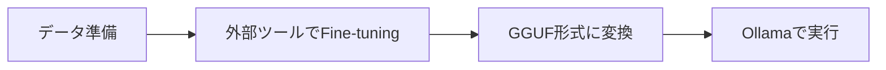

# Fine-tuning ガイドライン（プレゼンテーション用）

> **重要**: このガイドラインは、Fine-tuningとOllamaの関係を正しく理解し、プレゼンテーションで説明するための資料です。

## 📊 プレゼンテーションの構成

### 1. イントロダクション：誤解を解く

**スライド内容**:
```
❌ よくある誤解：
"OllamaでFine-tuningができる"

✅ 正しい理解：
"外部ツールでFine-tuning → Ollamaで実行"
```

**説明ポイント**:
- Ollamaは「実行専用」ツール
- Fine-tuningは別のツールで行う必要がある
- 最終的な実行環境としてOllamaを使用

### 2. なぜOllamaはFine-tuningをサポートしないのか？

**3つの理由**:
1. **設計思想**: モデルの「実行」に特化
2. **リソース制約**: ローカル実行を前提（GPUクラスタ不要）
3. **技術的制限**: GGUF形式 vs PyTorch/TensorFlow形式

### 3. Ollamaでできること・できないこと

**できること（プロンプトエンジニアリング）**:
- システムプロンプトのカスタマイズ
- Few-shot学習の例を追加
- パラメータ調整（temperature、top_p等）

**できないこと（真のFine-tuning）**:
- モデルの重み更新
- 新しい知識の学習
- ドメイン特化の深い学習

### 4. 実践的なワークフロー



**ツール選択肢**:
- **GPU環境**: Google Colab + Unsloth
- **Mac環境**: MLX または PyTorch
- **変換**: llama.cpp

### 5. 実例：カスタマーサポートBot

**Before（プロンプトエンジニアリング）**:
```
質問: 商品を返品したいです
回答: [英語で一般的な返品手順]
```

**After（Fine-tuning + Ollama）**:
```
質問: 商品を返品したいです
回答: 返品承知いたしました。14日以内であれば...
```

### 6. モデルサイズと効果

| モデル | Fine-tuning効果 | 推奨用途 |
|--------|----------------|----------|
| 1.1B | 限定的（英語のまま） | テスト用 |
| 3B+ | 良好（日本語対応） | 実用 |
| 7B+ | 優秀 | 本番環境 |

### 7. ベストプラクティス

**開発フロー**:
1. **プロトタイプ**: Ollamaでプロンプトエンジニアリング
2. **評価**: 効果が不十分なら→
3. **Fine-tuning**: 外部ツールで実施
4. **実行**: Ollamaで本番運用

**データ要件**:
- 最小: 50-100サンプル
- 推奨: 500-1000サンプル
- 品質 > 量

### 8. 実装例

#### Quick Start（15分）
```bash
# 1. Google ColabでFine-tuning
# 2. GGUFファイルをダウンロード
# 3. Ollamaで実行
ollama create my-model -f Modelfile
ollama run my-model "質問"
```

#### Mac Local（1時間）
```bash
# PyTorchでFine-tuning
python scripts/mac_local_fine_tuning.py

# テスト実行
python test_finetuned_model.py
```

### 9. まとめ：正しい期待値設定

**Ollama = 実行環境**
- 高速なローカル推論
- 簡単なモデル管理
- プロンプトエンジニアリング

**Fine-tuning = 外部ツール**
- 新しい知識の学習
- ドメイン特化
- スタイル・トーンの調整

### 10. Q&A想定

**Q: なぜOllamaはFine-tuningを追加しないの？**
A: 設計思想の違い。実行に特化することで、シンプルさと使いやすさを維持。

**Q: プロンプトエンジニアリングで十分？**
A: 多くの場合は十分。新しい知識が必要な場合のみFine-tuning。

**Q: Fine-tuningの費用は？**
A: Google Colab無料枠で小規模なら可能。本格的にはGPU費用が必要。

## 🎯 プレゼンのコツ

1. **最初に誤解を解く**: OllamaはFine-tuningツールではない
2. **ワークフローを視覚化**: データ→Fine-tuning→変換→Ollama
3. **実例で示す**: Before/Afterの具体例
4. **現実的な期待値**: 何ができて何ができないか

## 📚 参考資料

- [メインREADME](../README.md) - 包括的なガイド
- [Mac Fine-tuningガイド](mac_fine_tuning_guide.md) - 詳細な技術情報
- [Colab Quick Start](colab_quick_start.md) - 最速の実践方法