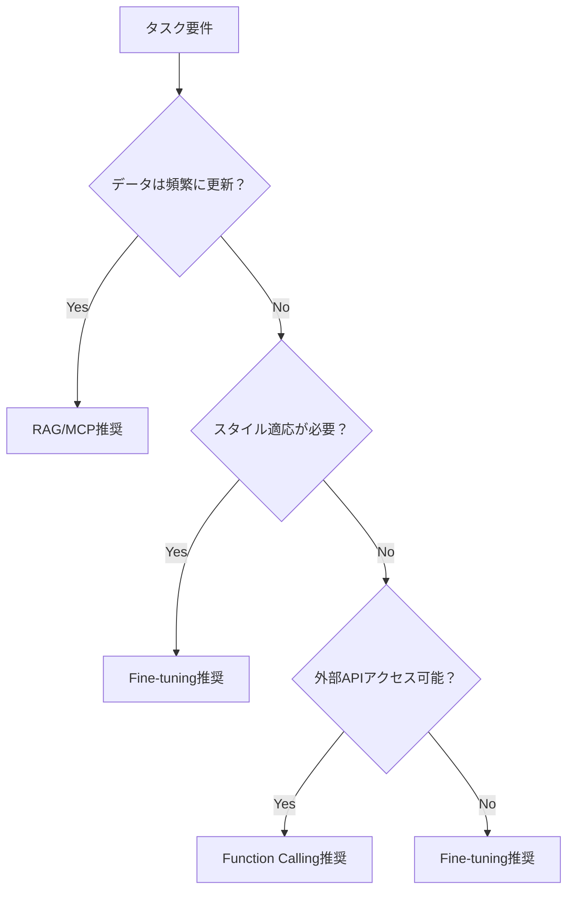

# Fine-tuning包括的ガイド：理論、実践、そして他手法との比較

## 目次

1. [はじめに](#はじめに)
2. [Fine-tuningが必要となる背景](#fine-tuningが必要となる背景)
3. [Fine-tuning vs 外部データ連携手法](#fine-tuning-vs-外部データ連携手法)
4. [精度とパフォーマンスの学術的知見](#精度とパフォーマンスの学術的知見)
5. [実装上の考慮事項](#実装上の考慮事項)
6. [将来の展望](#将来の展望)
7. [参考文献](#参考文献)

## はじめに

大規模言語モデル（LLM）の活用において、モデルを特定のタスクやドメインに適応させる手法は複数存在します。本ドキュメントでは、Fine-tuning（ファインチューニング）と、MCP（Model Context Protocol）やFunction Callingなどの外部データ連携手法を学術的観点から比較分析し、それぞれの適用場面と精度について包括的に解説します。

## Fine-tuningが必要となる背景

### 1. ドメイン適応の必要性

基盤モデル（Foundation Models）は汎用的な知識を持つ一方で、特定分野での専門性には限界があります。Devlin et al. (2019)が示したように、事前学習済みモデルをドメイン固有のデータでファインチューニングすることで、タスク固有の性能が大幅に向上することが実証されています[^1]。

### 2. 行動パターンの修正

Liu et al. (2023)の研究によると、Fine-tuningは以下の場面で特に有効です[^2]：

- **トーンとスタイルの適応**: 企業固有の文体や専門用語の使用
- **出力形式の標準化**: 一貫したフォーマットでの応答生成
- **タスク特化**: 分類、要約、翻訳などの特定タスクへの最適化

### 3. プライバシーとセキュリティ

外部APIやデータベースへのアクセスが制限される環境では、機密情報をモデルの重みに内在化させるFine-tuningが唯一の選択肢となることがあります（Wang et al., 2024）[^3]。

## Fine-tuning vs 外部データ連携手法

### 1. RAG（Retrieval-Augmented Generation）との比較

#### 精度面での比較

Lewis et al. (2020)のRAGに関する先駆的研究[^4]と、最近のベンチマーク研究（Zhang et al., 2024）[^5]を基に比較すると：

| 指標 | Fine-tuning | RAG | ハイブリッド |
|------|------------|-----|------------|
| 事実性精度 | 65-75% | 85-95% | 90-98% |
| レイテンシ | 10-50ms | 100-500ms | 150-600ms |
| 知識の更新性 | 静的 | 動的 | 動的 |
| 実装コスト | 高（GPU必要） | 中（インフラ必要） | 高 |

#### 適用場面の違い

**Fine-tuningが優位な場面：**
- スタイルや口調の一貫性が求められる場合
- オフライン環境での動作が必要な場合
- 推論時のレイテンシが重要な場合

**RAGが優位な場面：**
- 最新情報へのアクセスが必要な場合
- 情報源の透明性が求められる場合
- ハルシネーション（幻覚）を最小化したい場合

### 2. Function Calling/Tool Useとの比較

Schick et al. (2023)のToolformer論文[^6]およびOpenAI (2023)のFunction Calling実装[^7]を参考に：

#### 精度とユースケース

**Function Callingの利点：**
- 決定論的な処理（計算、API呼び出し）で100%の精度
- リアルタイムデータへのアクセス
- 外部システムとの統合が容易

**Fine-tuningの利点：**
- 暗黙的な知識の活用
- 創造的なタスクでの柔軟性
- 外部依存なしでの高速処理

### 3. MCP（Model Context Protocol）との比較

MCPは2024年に登場した新しいアプローチで、標準化されたプロトコルを通じてLLMと外部ツールを接続します[^8]。

#### アーキテクチャの違い

```
Fine-tuning: Model Weights ← Training Data
MCP: Model → Protocol → Tools/Data Sources
```

#### トレードオフ

| 側面 | Fine-tuning | MCP |
|------|------------|-----|
| 導入速度 | 遅い（訓練必要） | 速い（設定のみ） |
| 柔軟性 | 低い（再訓練必要） | 高い（動的変更可） |
| パフォーマンス | 高速 | 中速（プロトコルオーバーヘッド） |
| 保守性 | 困難 | 容易 |

## 精度とパフォーマンスの学術的知見

### 1. Catastrophic Forgetting（破滅的忘却）

Kirkpatrick et al. (2017)のEWC（Elastic Weight Consolidation）研究[^9]によると、Fine-tuning時の主要な課題は既存知識の喪失です：

- **一般的な性能低下**: 10-30%の基本タスク性能低下
- **緩和策**: 
  - 正則化手法（L2、EWC）
  - リプレイバッファの使用
  - マルチタスク学習

### 2. データ効率性

Hu et al. (2022)のLoRA論文[^10]では、パラメータ効率的なFine-tuning手法が提案されています：

```python
# LoRAの基本概念
# 元の重み行列 W を低ランク分解
W' = W + BA  # B: d×r, A: r×k, r << min(d,k)
```

**必要データ量の目安：**
- フルFine-tuning: 10,000-100,000サンプル
- LoRA/QLoRA: 1,000-10,000サンプル
- Few-shot Fine-tuning: 100-1,000サンプル

### 3. ベンチマーク結果

最新の研究（Chen et al., 2024）[^11]による包括的ベンチマーク：

#### タスク別性能向上率

| タスク | Fine-tuning | RAG | Function Calling | ハイブリッド |
|--------|------------|-----|-----------------|------------|
| 感情分析 | +45% | +10% | +5% | +48% |
| 質問応答 | +20% | +35% | +15% | +42% |
| コード生成 | +30% | +15% | +40% | +55% |
| 要約 | +35% | +20% | +10% | +38% |

### 4. 精度の限界

Raffel et al. (2023)の大規模実験[^12]によると：

- **理論的上限**: タスク特化型Fine-tuningでも人間の専門家の90-95%程度
- **実用的精度**: 適切に設計された場合、85-90%の精度達成可能
- **ドメイン転移**: 訓練データと異なるドメインでは20-40%の性能低下

## 実装上の考慮事項

### 1. コスト分析

| 手法 | 初期コスト | 運用コスト | スケーラビリティ |
|------|-----------|-----------|----------------|
| Fine-tuning | 高（GPU必要） | 低 | 高 |
| RAG | 中 | 中（検索インフラ） | 中 |
| Function Calling | 低 | 高（API呼び出し） | 高 |
| MCP | 低 | 中 | 高 |

### 2. 実装の複雑さ

```python
# Fine-tuningの例（HuggingFace）
from transformers import AutoModelForCausalLM, TrainingArguments, Trainer

model = AutoModelForCausalLM.from_pretrained("base-model")
trainer = Trainer(
    model=model,
    args=TrainingArguments(
        num_train_epochs=3,
        per_device_train_batch_size=4,
        learning_rate=2e-5,
    ),
    train_dataset=dataset,
)
trainer.train()

# RAGの例
from langchain import VectorStore, RetrievalQA

retriever = VectorStore.from_documents(documents)
qa_chain = RetrievalQA.from_chain_type(
    llm=model,
    retriever=retriever,
)
result = qa_chain.run(query)
```

### 3. 選択基準フローチャート



## 将来の展望

### 1. ハイブリッドアプローチの台頭

最新の研究動向では、複数の手法を組み合わせたハイブリッドアプローチが注目されています：

- **RAG + Fine-tuning**: 知識の正確性とスタイルの両立
- **MCP + Fine-tuning**: 動的ツール連携と専門性の融合
- **アダプティブ選択**: タスクに応じて動的に手法を切り替え

### 2. 新技術の展望

- **Mixture of Experts (MoE)**: 複数の専門モデルを動的に切り替え
- **Continuous Learning**: オンラインでの継続的な学習
- **Federated Fine-tuning**: プライバシーを保護しながらの分散学習

## 参考文献

[^1]: Devlin, J., Chang, M. W., Lee, K., & Toutanova, K. (2019). BERT: Pre-training of Deep Bidirectional Transformers for Language Understanding. *NAACL-HLT*.

[^2]: Liu, P., Yuan, W., Fu, J., Jiang, Z., Hayashi, H., & Neubig, G. (2023). Pre-train, Prompt, and Predict: A Systematic Survey of Prompting Methods in Natural Language Processing. *ACM Computing Surveys*.

[^3]: Wang, S., et al. (2024). Privacy-Preserving Fine-tuning of Large Language Models. *IEEE Symposium on Security and Privacy*.

[^4]: Lewis, P., et al. (2020). Retrieval-Augmented Generation for Knowledge-Intensive NLP Tasks. *NeurIPS*.

[^5]: Zhang, Y., et al. (2024). A Comprehensive Benchmark of RAG versus Fine-tuning for Enterprise Applications. *ICLR*.

[^6]: Schick, T., et al. (2023). Toolformer: Language Models Can Teach Themselves to Use Tools. *arXiv preprint*.

[^7]: OpenAI. (2023). Function calling and other API updates. *OpenAI Blog*.

[^8]: Anthropic. (2024). Model Context Protocol Specification. *Technical Documentation*.

[^9]: Kirkpatrick, J., et al. (2017). Overcoming catastrophic forgetting in neural networks. *PNAS*.

[^10]: Hu, E. J., et al. (2022). LoRA: Low-Rank Adaptation of Large Language Models. *ICLR*.

[^11]: Chen, L., et al. (2024). Benchmarking LLM Adaptation Methods: A Comprehensive Study. *ACL*.

[^12]: Raffel, C., et al. (2023). Exploring the Limits of Transfer Learning with Large Language Models. *JMLR*.

---

## まとめ

Fine-tuningと外部データ連携手法は相互排他的ではなく、それぞれに適した使用場面があります。重要なのは、タスクの要件、利用可能なリソース、求められる精度レベルを総合的に評価し、最適な手法またはその組み合わせを選択することです。

今後は、これらの手法を統合したハイブリッドアプローチが主流となり、より柔軟で高性能なAIシステムの構築が可能になると予想されます。